# Bizlytic - Business Dashboard Architecture

## System Overview
Bizlytic is a business dashboard application designed for small business owners to track sales, expenses, and profit with two distinct service tiers.

## Architecture Diagram

```mermaid
graph TB
    %% Styling
    classDef basicPlan fill:#e3f2fd,stroke:#1976d2,stroke-width:2px
    classDef proPlan fill:#f3e5f5,stroke:#7b1fa2,stroke-width:2px
    classDef shared fill:#e8f5e8,stroke:#388e3c,stroke-width:2px
    classDef storage fill:#fff3e0,stroke:#f57c00,stroke-width:2px
    classDef external fill:#ffebee,stroke:#d32f2f,stroke-width:2px

    %% User Interface Layer
    subgraph UI ["🎨 Frontend - React + Shadcn UI"]
        Login["🔐 Login/Authentication"]
        Dashboard["📊 Dashboard"]
        Reports["📈 Reports"]
        Calendar["📅 Calendar View"]
        Settings["⚙️ Settings"]
    end

    %% Authentication Flow
    subgraph Auth ["🔑 Authentication System"]
        BasicAuth["Basic Plan Auth<br/>(Local Only)"]
        ProAuth["Pro Plan Auth<br/>(JWT + OAuth)"]
    end

    %% Basic Plan Components
    subgraph Basic ["💻 Basic Plan - Local Only"]
        BasicStorage["💾 Local Storage<br/>(IndexedDB + LocalStorage)"]
        BasicSync["🔄 Offline-First<br/>No Cloud Sync"]
        BasicExport["📤 Export to Excel/PDF<br/>(Local Processing)"]
    end

    %% Pro Plan Components
    subgraph Pro ["☁️ Pro Plan - Cloud Based"]
        ProAPI["🚀 Backend API<br/>(Node.js + Express)"]
        ProDB["🗄️ Database<br/>(PostgreSQL/MongoDB)"]
        ProSync["🔄 Multi-Device Sync<br/>Real-time Updates"]
        ProBackup["💾 Cloud Backup<br/>& Recovery"]
        ProExport["📤 Advanced Export<br/>(Server Processing)"]
    end

    %% Shared Components
    subgraph Shared ["🔄 Shared Components"]
        Charts["📊 Charting Library<br/>(Recharts)"]
        OfflineSupport["📱 Offline Support<br/>(Service Workers)"]
        DataValidation["✅ Data Validation<br/>& Business Logic"]
    end

    %% External Services
    subgraph External ["🌐 External Services"]
        EmailService["📧 Email Service<br/>(SendGrid/AWS SES)"]
        FileStorage["📁 File Storage<br/>(AWS S3/Cloudinary)"]
        Analytics["📊 Analytics<br/>(Google Analytics)"]
    end

    %% Data Flow Connections
    %% Basic Plan Flow
    UI --> BasicAuth
    BasicAuth --> BasicStorage
    BasicStorage --> BasicSync
    BasicStorage --> BasicExport
    BasicStorage --> Charts
    BasicStorage --> OfflineSupport

    %% Pro Plan Flow
    UI --> ProAuth
    ProAuth --> ProAPI
    ProAPI --> ProDB
    ProDB --> ProSync
    ProSync --> ProBackup
    ProAPI --> ProExport
    ProAPI --> Charts
    ProAPI --> OfflineSupport

    %% Shared Connections
    Charts --> UI
    OfflineSupport --> UI
    DataValidation --> BasicStorage
    DataValidation --> ProAPI

    %% External Service Connections
    ProAuth --> EmailService
    ProExport --> FileStorage
    ProAPI --> Analytics

    %% Offline Behavior
    OfflineSupport -.-> BasicStorage
    OfflineSupport -.-> ProAPI

    %% Apply Styling
    class Basic,BasicAuth,BasicStorage,BasicSync,BasicExport basicPlan
    class Pro,ProAuth,ProAPI,ProDB,ProSync,ProBackup,ProExport proPlan
    class Shared,Charts,OfflineSupport,DataValidation shared
    class BasicStorage,ProDB,ProBackup storage
    class External,EmailService,FileStorage,Analytics external
```

## Key Features by Plan

### 🆓 Basic Plan
- **Storage**: Browser-based (IndexedDB + LocalStorage)
- **Sync**: Offline-first, single device
- **Authentication**: Local session management
- **Export**: Client-side Excel/PDF generation
- **Cost**: Free

### 💎 Pro Plan
- **Storage**: Cloud database with real-time sync
- **Sync**: Multi-device, real-time updates
- **Authentication**: JWT + OAuth integration
- **Export**: Server-side processing with cloud storage
- **Backup**: Automated cloud backup and recovery
- **Cost**: Monthly subscription

## Data Flow Patterns

### Basic Plan Flow
1. User logs in → Local authentication
2. Data stored in browser storage
3. Offline-first operation
4. Local export processing
5. No cloud synchronization

### Pro Plan Flow
1. User logs in → JWT authentication
2. Data stored in cloud database
3. Real-time multi-device sync
4. Server-side export processing
5. Automated backup and recovery

## Technical Stack

- **Frontend**: React 18 + TypeScript + Shadcn UI
- **Charts**: Recharts library
- **Backend**: Node.js + Express + TypeScript
- **Database**: PostgreSQL (primary) + Redis (cache)
- **Storage**: AWS S3 for file storage
- **Authentication**: JWT + OAuth 2.0
- **Real-time**: WebSocket connections
- **Offline**: Service Workers + IndexedDB

## Security Features

- **Basic Plan**: Local encryption of sensitive data
- **Pro Plan**: End-to-end encryption, role-based access control
- **Both**: Input validation, XSS protection, CSRF tokens